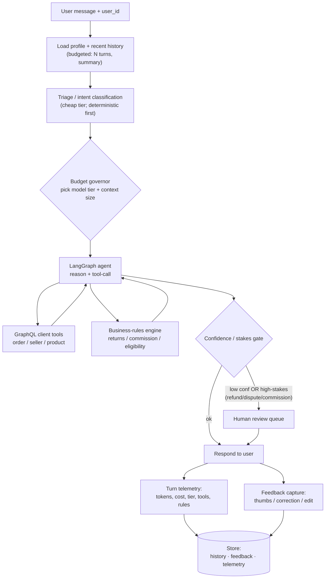
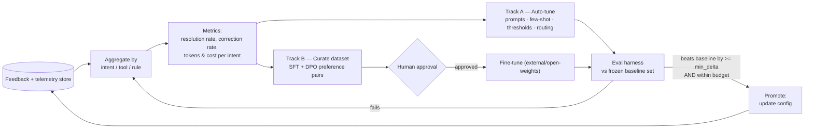

# Marketplace CX AI Agent

> A modular, cost-governed **agentic AI customer-experience assistant** for an online-marketplace domain — with a human-in-the-loop improvement loop and a live performance/cost analytics dashboard.


## Overview

Customer-support questions for an online marketplace ("can I return this?", "what's the seller commission?", "am I covered by buyer protection?") mix **policy**, **per-order data**, and **money** — so answers must be both *grounded in real data* and *cheap to produce at scale*. This project is an LLM agent that does both: it classifies an incoming message, fetches the relevant order data over **GraphQL**, applies a **versioned business-rules engine** for anything financial, and only then composes a reply — escalating high-stakes cases to a human.

The headline design goal is **cost as a control surface**. A deterministic triage rung and a static-FAQ short-circuit answer most messages with **zero LLM calls**; a tier router sends only the hard cases to a capable model; a semantic cache absorbs repeats. Every turn is metered, and the resulting telemetry powers a built-in analytics dashboard that shows exactly how much each module saves.

> This is an **unaffiliated, educational demo** built on **synthetic data**. It models a generic marketplace domain and is not associated with any real marketplace company.

## Features

- **Agentic pipeline** (LangGraph): `triage → classify → retrieve → stakes-gate → respond → finalize`.
- **GraphQL data layer** (Strawberry + FastAPI) the agent consumes over HTTP — a clean service split, served and consumed in-repo.
- **Versioned rules engine** for returns (14-day window, category rules, free returns for members), per-category seller **commission**, and refund/dispute/buyer-protection **eligibility** — deterministic, not model guesswork.
- **Cost governor:** deterministic triage + static FAQ (zero-LLM paths), a cheap→capable **tier router**, token **ceilings with a graceful degradation ladder**, and a **semantic response cache**.
- **Human-in-the-loop feedback** (flagged + random-audit sample) feeding a **semi-automatic improvement loop**: metric aggregation, an eval harness with a **promotion gate**, prompt/few-shot/threshold auto-tuning (Track A), and DPO/SFT dataset export (Track B).
- **Personalization** from a budget-aware profile + conversation-history context builder.
- **Live analytics dashboard** (`/analytics`) attributing cost to each module and surfacing the optimization read.
- **107 passing tests** (pytest), fully mocked — no network needed to run them.

## Demo

### Performance & cost analytics dashboard

Served at `/analytics`, built entirely from per-turn telemetry (the census) + the reviewed-feedback sample. The headline metric is honest: against a naive baseline of **2 LLM calls per turn** (classify + respond), how many the cascade + cache actually avoided.

```
Headline ─────────────────────────────────────────────────
  LLM calls avoided   59.7%      (43 of 72 naive calls cut)
  classify deflection 88.9%      intent resolved w/o an LLM
  zero-LLM turns      30.6%      FAQ + cache hits
  avg LLM calls/turn  0.81       (naive baseline = 2.0)
  HITL escalation     25.0%

Module operations ────────────────────────────────────────
  Triage classifier   58%   saved 21 classifier calls
  FAQ short-circuit   31%   fully free turns (0 LLM)
  Tier router         36%   premium reserved for high-stakes
  HITL gate           25%   escalation in a healthy band
  Frozen eval         73.7% overall accuracy (promotion gate)
```

Populate it with a realistic run, then open the dashboard:

```bash
python scripts/improvement/seed_demo.py --eval
python scripts/graphql_server/app.py      # → http://127.0.0.1:8000/analytics
```

## Architecture / How it works

### Runtime request flow



### Improvement loop (HITL → semi-automatic tuning)



Track A is the automatic degree (prompt/config optimization, eval-gated); Track B keeps real weight fine-tuning honest — gated, human-approved, and external — because the inference gateway can't fine-tune.

## Tech Stack

- **Language:** Python 3.12
- **Agent core:** LangGraph 1.0 + LangChain 1.2 (`langchain-openai` for any OpenAI-compatible gateway)
- **API / data layer:** Strawberry GraphQL 0.317 + FastAPI 0.115 / uvicorn; httpx client
- **Validation / config:** pydantic 2.10, PyYAML 6.0
- **Storage:** SQLite (marketplace data, profiles/history, feedback, telemetry — separate DBs)
- **LLM:** any **OpenAI-compatible** chat + embeddings gateway, configured by env vars (`LLM_BASE_URL` / `LLM_MODEL` / `LLM_API_KEY`)

## Getting Started

### Prerequisites
- Python 3.12 on PATH (python.org install; tick "Add to PATH").

### Installation
```bash
git clone https://github.com/Drzymek92/marketplace-cx-ai-agent.git
cd marketplace-cx-ai-agent
python -m venv .venv
.venv\Scripts\activate          # Windows  (source .venv/bin/activate on macOS/Linux)
pip install -r requirements.txt
cp config/.env.example config/.env   # then fill in your LLM gateway URL/model/key
```

The agent degrades gracefully without LLM credentials (deterministic triage + templated answers), so the demo and the full test suite run offline — credentials simply unlock LLM-composed replies.

### Usage
```bash
# Run the demo server: chat UI at /, analytics at /analytics, GraphQL at /graphql
python scripts/graphql_server/app.py        # → http://127.0.0.1:8000

# Seed a realistic run so the analytics dashboard is populated (+ cache an eval snapshot)
python scripts/improvement/seed_demo.py --eval

# Run the tests
pytest tests/
```

## Project Structure

```
marketplace-cx-ai-agent/
├── scripts/
│   ├── graphql_server/   # Strawberry schema, FastAPI app, SQLite, seed data
│   ├── graphql_client/   # httpx client the agent consumes
│   ├── agent/            # LangGraph flow, triage, tools, FAQ, web UI + dashboard
│   ├── rules/            # versioned returns / commission / eligibility engine
│   ├── budget/           # tier router, governor, semantic cache, telemetry
│   ├── feedback/         # HITL capture + simulated reviewer store
│   ├── improvement/      # aggregation, eval harness, auto-tuning, analytics, seeder
│   ├── profile/          # budget-aware profile + history context
│   ├── llm_client.py     # OpenAI-compatible LLM client
│   └── prompt_compressor.py
├── config/               # requirements, .env.example, example config.yaml
└── tests/                # 107 pytest tests (mocked LLM + GraphQL)
```

## License

This project is licensed under the MIT License — see [LICENSE](LICENSE).
